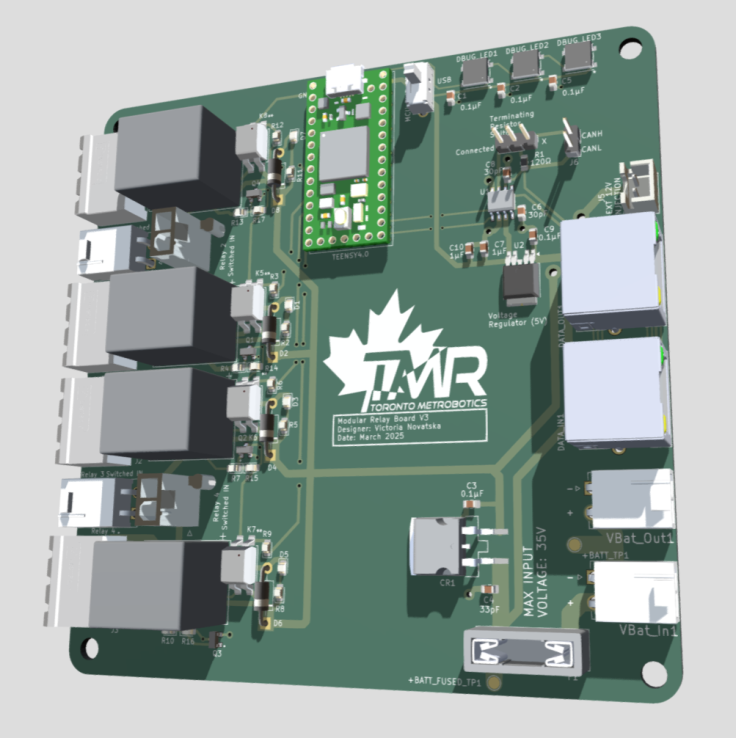
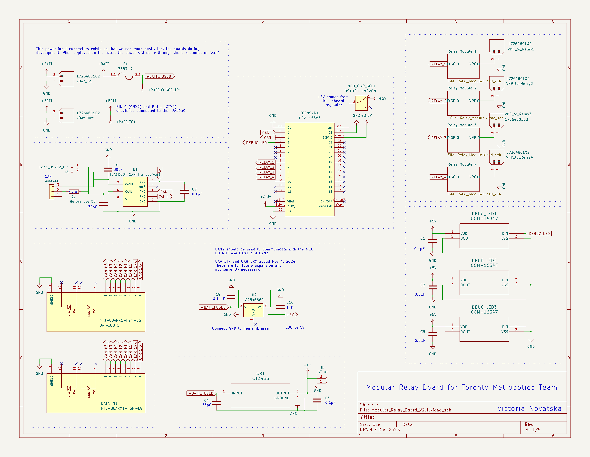

# Modular Relay Board PCB TMR

A 4 channel relay board made for the Toronto Metropolitan Robotics team for higher voltage inputs to be switched using the onboard Teensy 4.1 MCU. 
I have linked the 3D model below, and a high resolution pdf of the schematic can be found in the repository. 

[View Interactive 3D Model](https://skfb.ly/pACNG)

